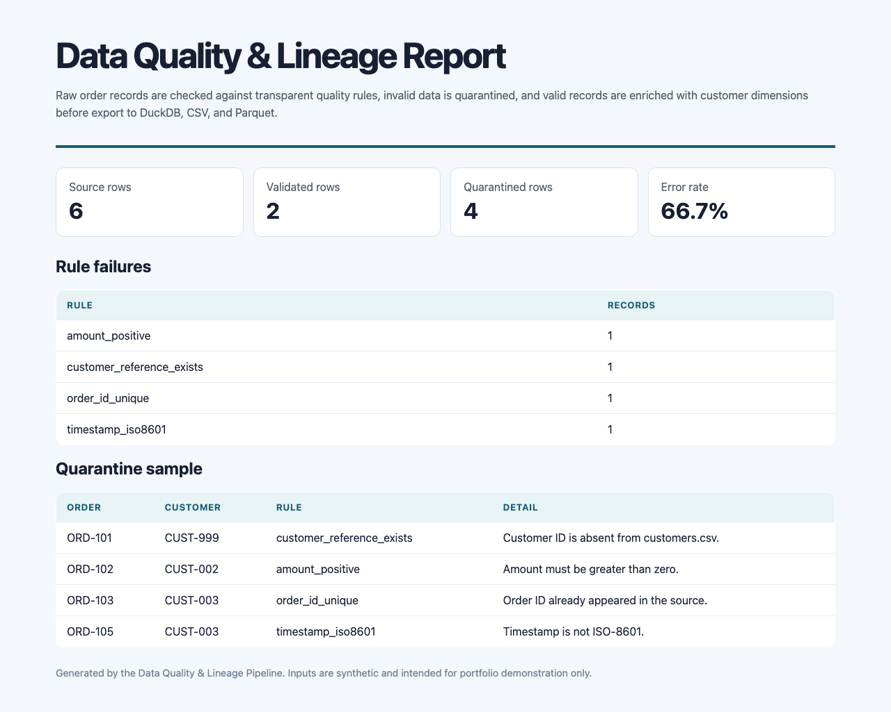
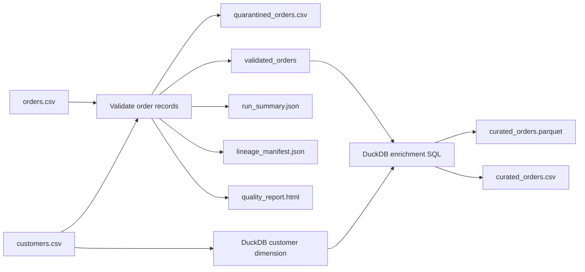

# Data Quality & Lineage Pipeline

A runnable Python and DuckDB project that validates raw order data, quarantines records that break data-quality rules, enriches valid orders with customer data, and creates analytical artefacts with an explicit lineage manifest.

> **Scope note:** This is a portfolio demonstrator using synthetic CSV data. It demonstrates data-engineering practices, not a production customer-data platform.



## What it proves

- Python pipeline design and CLI delivery.
- DuckDB SQL, CSV ingestion, analytical tables, CSV export, and Parquet output.
- Data-quality checks for required IDs, duplicate orders, valid customer references, positive monetary values, and ISO-8601 timestamps.
- Quarantine handling rather than silently dropping defective records.
- Data lineage recorded as JSON: source datasets, transformations, rules, and outputs.
- A CI-friendly quality gate that fails when the observed error rate exceeds a configured budget.
- Tests that inspect generated data and DuckDB output, not just helper functions.

## Run it

Requirements: Python 3.11+.

```bash
git clone https://github.com/mithulram/data-quality-lineage-pipeline.git
cd data-quality-lineage-pipeline
python3 -m venv .venv
source .venv/bin/activate
python -m pip install --upgrade pip
python -m pip install -e .

quality-lineage run \
  --source examples/source \
  --output artifacts \
  --max-error-rate 0.8
```

Open `artifacts/quality_report.html` to view the report. The sample deliberately includes four bad rows, so its `66.7%` error rate only passes when the quality budget is above that threshold.

## Outputs

| Artefact | Why it exists |
|---|---|
| `quality_pipeline.duckdb` | Reproducible local analytical database with raw dimensions and curated orders |
| `curated_orders.parquet` | Columnar analytical output for downstream query engines |
| `curated_orders.csv` | Human-readable analytical export |
| `quarantined_orders.csv` | Records withheld from the curated dataset, with failing rule names |
| `run_summary.json` | Run counts, error rate, rule counts, and output inventory |
| `lineage_manifest.json` | Dataset-level lineage and transparent transformation descriptions |
| `quality_report.html` | Recruiter-friendly visual quality report |

## Quality rules

| Rule | Behaviour |
|---|---|
| `order_id_required` | Rejects blank order IDs |
| `order_id_unique` | Rejects a repeated order ID within the source batch |
| `customer_reference_exists` | Rejects orders whose customer does not exist in `customers.csv` |
| `amount_positive` | Rejects zero or negative order values |
| `amount_decimal` | Rejects malformed monetary values |
| `timestamp_iso8601` | Rejects malformed timestamps |

## Lineage



The implementation uses DuckDB tables for validated and curated records. It writes both Parquet and CSV via DuckDB `COPY` statements, following the database's documented file-import/export model.

## Verify

```bash
python -m unittest discover -s tests -v
python -m compileall -q src tests

# Demonstrate a quality-gate failure. Expected exit code: 2.
quality-lineage run --source examples/source --output artifacts --max-error-rate 0.5
```

## Resume-ready description

> Built a Python/DuckDB data-quality pipeline that validates order batches, quarantines bad records, enriches valid data with customer dimensions, exports CSV and Parquet outputs, and emits auditable lineage and quality-report artefacts under a configurable error-rate gate.

## License

MIT. See [LICENSE](LICENSE).
